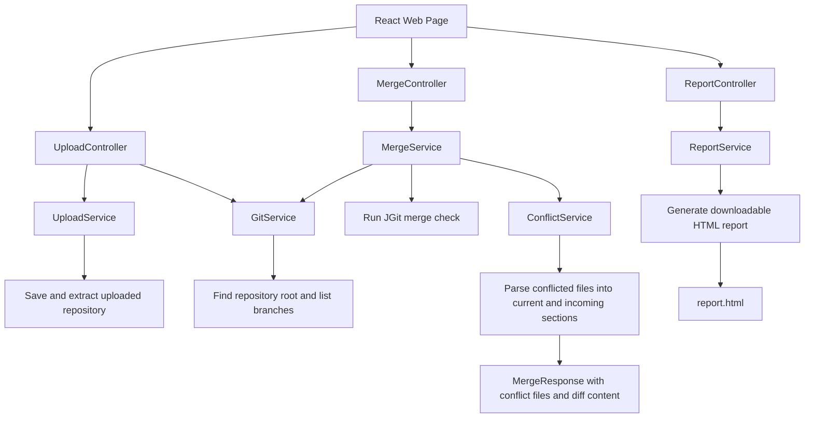

# Git Merge Conflict Visualizer

One of the most frustrating parts of collaborating with Git is dealing with merge conflicts. I have always found Git's conflict markers confusing and counterintuitive, so I built Git Merge Conflict Visualizer: an easy way to detect and review all merge conflicts between two branches.

On the web page, users can upload a Git repository, select the two branches they want to compare, and run a merge check directly from the browser. The app reports whether the merge would succeed cleanly or whether conflicts exist. If conflicts are found, it returns a clear list of the affected files, opens each conflict in a side-by-side diff view, and can generate an HTML report for sharing or later review. This makes it easier to compare what changed on each branch without digging through raw Git conflict markers.

## Controller-Service Pattern

The backend follows a controller-service pattern to keep the API layer separate from the merge-analysis logic. Controllers receive HTTP requests from the frontend, validate and unpack request data, then pass the actual work to services. Services handle the core behavior: saving uploaded repositories, reading Git branches, running merge checks with JGit, parsing conflict sections, and generating the HTML report.

This keeps each class focused. For example, `MergeController` only handles the `/api/merge` request and response status, while `MergeService` performs the merge check and asks `ConflictService` to turn raw Git conflict output into structured conflict details for the side-by-side diff.

