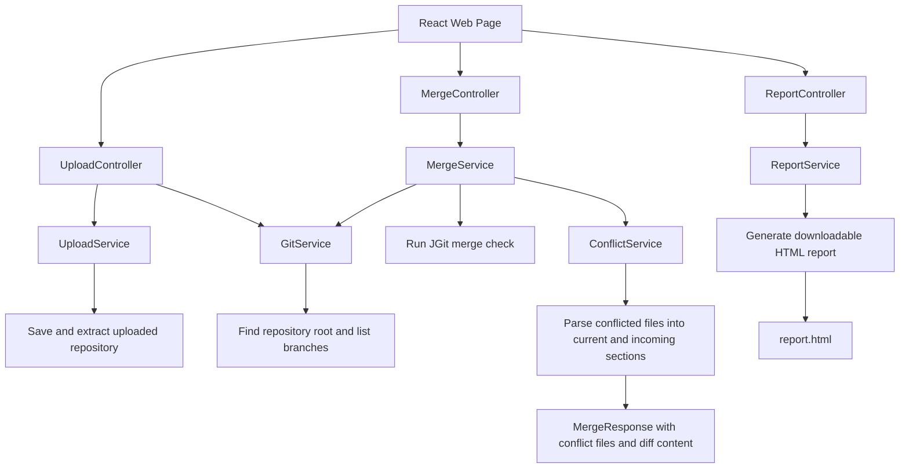

# Git Merge Conflict Visualizer

One of the most frustrating parts of collaborating with Git is dealing with merge conflicts. I have always found Git's conflict markers confusing and counterintuitive, so I built Git Merge Conflict Visualizer: an easy way to detect and review all merge conflicts between two branches.

On the web page, users can upload a Git repository, select the two branches they want to compare, and run a merge check directly from the browser. The app reports whether the merge would succeed cleanly or whether conflicts exist. If conflicts are found, it returns a clear list of the affected files, opens each conflict in a side-by-side diff view, and can generate an HTML report for sharing or later review. This makes it easier to compare what changed on each branch without digging through raw Git conflict markers.

## Features

- Upload a zipped Git repository through the web interface.
- View available branches from the uploaded repository.
- Check whether two selected branches can merge cleanly.
- See a list of files that contain merge conflicts.
- Review conflicts in a side-by-side diff view.
- Download an HTML report with the merge result and conflict details.

## Tech Stack

- JavaScript: Implements the frontend application logic.
- React: Builds the interactive web interface for uploading repositories, selecting branches, and viewing conflicts.
- Vite: Provides the frontend development and build tooling.
- Java: Implements the backend application logic.
- Spring Boot: Powers the backend REST API.
- JGit: Runs Git operations in Java, including branch lookup and merge checks.
- Maven: Manages backend dependencies and builds the Spring Boot application.
- HTML/CSS: Styles the app UI and generated conflict report.

## Controller-Service Pattern

The backend follows a controller-service pattern to keep the API layer separate from the merge-analysis logic. Controllers receive HTTP requests from the frontend, validate and unpack request data, then pass the actual work to services. Services handle the core behavior: saving uploaded repositories, reading Git branches, running merge checks with JGit, parsing conflict sections, and generating the HTML report.

This keeps each class focused. For example, `MergeController` only handles the `/api/merge` request and response status, while `MergeService` performs the merge check and asks `ConflictService` to turn raw Git conflict output into structured conflict details for the side-by-side diff.


## Run Locally

After cloning the repository, start the backend and frontend in separate terminal windows.

Backend:

```bash
cd backend
mvn spring-boot:run
```

The backend runs on `http://localhost:8080`.

Frontend:

```bash
cd frontend
npm install
npm run dev
```

The frontend runs on the Vite URL shown in the terminal, usually `http://localhost:5173`. Open that URL in your browser, upload a zipped Git repository, choose the branches to compare, and run the merge check.

You can also use the deployed version here: https://git-merge-conflict-visualizer-frontend.onrender.com/

Please note that the deployed version may take a moment to wake up and may not support large uploads because it is hosted on Render's free plan.

Uploaded repositories are processed on the Render backend using temporary server storage. They are not saved to a database and should not be treated as permanently stored.

## Limitations

- Repositories must be uploaded as `.zip` files.
- Uploaded repositories are stored temporarily on the backend filesystem, not in a database.
- The deployed Render version may be slower to start because it uses the free plan.
- Large uploads may not work reliably on the deployed version.
- Conflicts can be viewed, but they cannot currently be resolved directly in the browser.

## Future Improvements

- Integrate an AI tool such as Ollama to analyze merge conflicts and suggest possible code resolutions.
- Add support for resolving conflicts directly in the browser and downloading the updated files.
- Improve report sharing by generating persistent share links or export options for completed merge checks.
